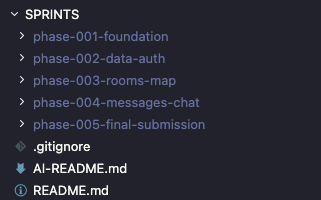
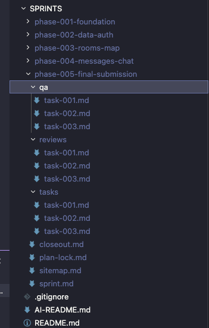
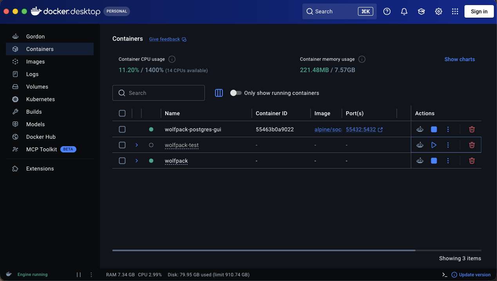
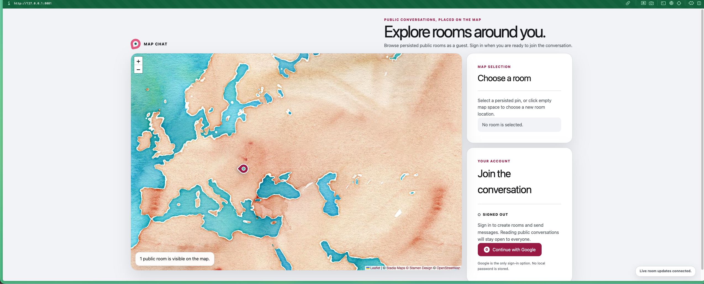
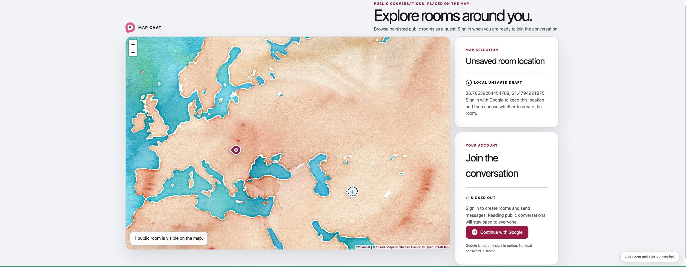
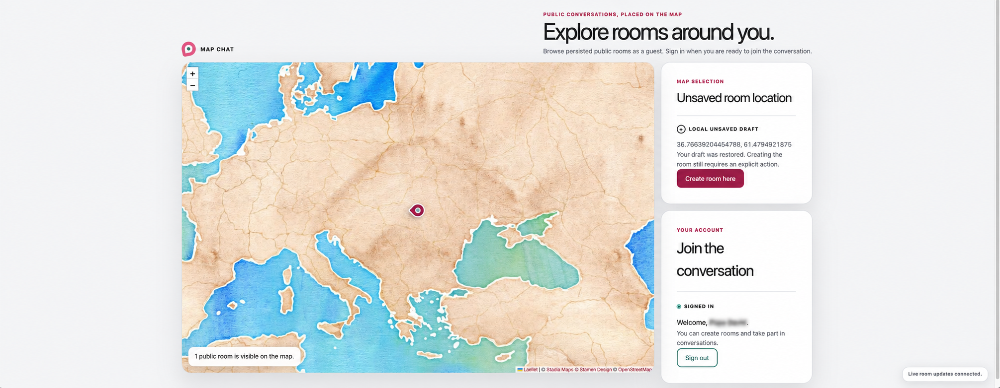
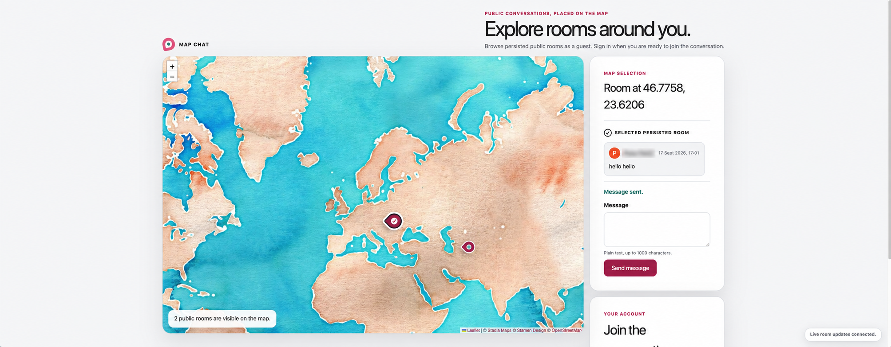
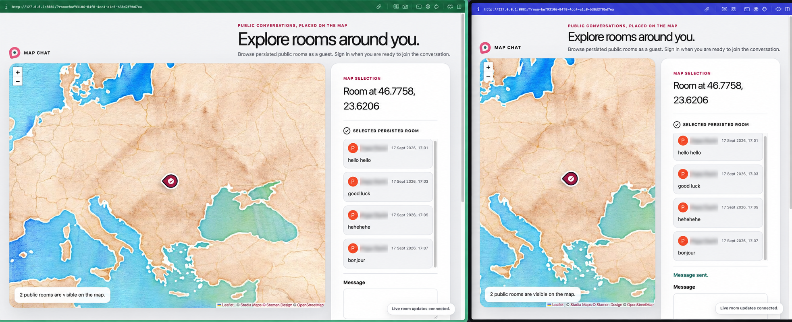

# Read First

> A short note about how I approached the assessment, including my use of AI-assisted development.
>
> **More details are available in [Documentation and onboarding](docs/ONBOARDING.md).** In Codex, open `/skills` and select `onboard-project` for a repository tour or `onboard-developer` for a guided, role-based journey.

I genuinely enjoyed working on this project. I especially appreciated the care put into the PDF and its UX direction, so I treated it as part of the product specification and carried its visual identity into the application.

## My approach

I deliberately kept the product and architecture focused. The complete journey is simple: explore the public map, select a room, sign in with Google when a write is required, create a pin, chat, and sign out. I avoided speculative abstractions and layers that would not provide a clear benefit for this scope.

I invested additional time in verification because testing is an essential part of a complete application. The project exercises the frontend, backend, PostgreSQL, Redis, realtime behavior, production proxy, and browser-level user flows.

## AI-assisted workflow

I used GPT transparently throughout development:

1. **Architecture:** GPT-6 Astra supported the initial architecture and technical trade-off discussions.
2. **Orchestration:** GPT-5.6 Sol High prepared bounded sprints and tasks through the project-specific `/create-sprint` and `/create-task` skills. It did not implement application code.
3. **Execution:** for each task, I launched a GPT-5.6 Sol Medium agent and separated the work into implementation, QA, and written review.
4. **Quality gate:** every stage concluded with `ready for phase continuation`, `changes required`, or `blocked`. A later task could not begin until the previous one was completed and reviewed.

I remained responsible for product decisions, approvals, Git operations, and the final result.

## Engineering workflow

- **Sprints, worktrees, and pull requests** kept each change isolated and the Git history easy to follow.
- **Project-specific skills and hooks** remained intentionally small and focused. In a production team, shared skills, hooks, agents, and MCP integrations would live in a dedicated team repository.
- **Docker environments** made application and integration-test behavior reproducible while keeping runtime failures easier to isolate.

### Sprint workspace

The local sprint workspace keeps the delivery phases visible while giving every task separate implementation, QA, and review records.

<table>
  <tr>
    <td align="center">
      
    </td>
    <td align="center">
      
    </td>
  </tr>
  <tr>
    <td align="center"><sub>Five bounded delivery phases</sub></td>
    <td align="center"><sub>Separate task, QA, and review packets</sub></td>
  </tr>
</table>

### Docker environments

<p align="center">
  
  <br>
  <sub>Separate Compose projects keep the production-like application and integration-test services isolated.</sub>
</p>

### Stack at a glance

| Area | Technical direction |
| --- | --- |
| Frontend | Next.js, TypeScript, Tailwind CSS, shadcn/ui, TanStack Query, Leaflet |
| Backend | Node.js, Express modular monolith, Better Auth, Socket.IO |
| Data | PostgreSQL with Prisma, Redis rate limiting |
| Verification | Jest, React Testing Library, Playwright Chromium, Docker Compose |

## Key technical decisions

### Why Better Auth

I chose Better Auth because it integrates directly into the Express application and stores users, sessions, accounts, and verification data in the project's own PostgreSQL database through Prisma. This avoids introducing a separate hosted identity-data layer or synchronizing application users through provider webhooks. Google remains the external OAuth provider, while session persistence and application authentication data stay within the system I control. See the [Better Auth database documentation](https://better-auth.com/docs/concepts/database) for the underlying model.

### Why vertical slices

I used a [vertical-slice approach](https://monday.com/blog/rnd/vertical-slice/) as a delivery principle: each increment aimed to complete a small user-facing capability across the relevant UI, API, persistence, realtime, and test boundaries before moving forward. This kept attention on working outcomes instead of building broad technical layers in isolation.

After learning how the team organizes feature delivery, I chose this approach to align the assessment with that environment and to demonstrate how I would structure, validate, and communicate work within the company.

---

# Map Chat

Map Chat is a full-stack map-based public chat application built for the Wolfpack Digital developer assessment. Visitors can browse persisted room pins and read paginated conversations. Google-authenticated users can create rooms and send plain-text messages. PostgreSQL is authoritative for rooms, messages and sessions; Redis provides atomic write-rate limits; Socket.IO delivers newly persisted rooms and room-scoped messages through the same browser origin.

The client handles optimistic room and message creation without putting temporary objects into canonical server caches. Stable client request IDs make retries idempotent, HTTP/socket arrival in either order deduplicates by canonical identity, and reconnect catch-up walks every newer message page for the currently selected room. The responsive interface preserves room selection, drafts, reading position and keyboard focus across late requests and realtime recovery.

The map uses Leaflet with the approved Stadia Maps-hosted Stamen Watercolor tiles and visible Stadia Maps, Stamen Design, OpenStreetMap and Leaflet attribution. [docs/MAP.md](docs/MAP.md) is the source of truth for provider configuration and licensing.

## Product walkthrough

<p align="center">
  
  <br>
  <sub>Browse persisted public rooms and conversations without signing in.</sub>
</p>

<table>
  <tr>
    <td width="50%" align="center">
      
      <br>
      <sub>A guest can choose a room location before authentication.</sub>
    </td>
    <td width="50%" align="center">
      
      <br>
      <sub>Google sign-in restores the draft and unlocks room creation.</sub>
    </td>
  </tr>
  <tr>
    <td width="50%" align="center">
      
      <br>
      <sub>Persisted rooms expose public history and authenticated messaging.</sub>
    </td>
    <td width="50%" align="center">
      
      <br>
      <sub>Two browser sessions receive the same room conversation in real time.</sub>
    </td>
  </tr>
</table>

## Product boundary

Implemented:

- public room pins and public chronological message history;
- stable `(createdAt, id)` message pagination for newest, older and forward catch-up pages;
- Google-only Better Auth sessions, with no local password provider;
- session-derived, PostgreSQL-idempotent room and message creation;
- atomic Redis rate limiting for both write types, with fail-closed writes and public reads remaining available;
- optimistic room/message attempts, targeted failure and stable-ID retry;
- one same-origin Socket.IO lifecycle for global `room.created` and selected-room `message.created` delivery;
- deduplication for HTTP-before-socket, socket-before-HTTP and duplicate delivery;
- multi-page reconnect reconciliation without changing a newer selection;
- responsive desktop/mobile chat, reader-controlled scrolling, keyboard controls, visible focus, semantic timestamps and accessible status/error announcements.

Intentionally excluded: private rooms, moderation, room renaming/deletion, pin movement, search, geolocation, profiles/roles, other login providers, message editing/deletion, attachments, reactions, threads, presence, typing indicators, read receipts, offline sending, push notifications, queues, message caches and horizontal scaling.

## Architecture

- `apps/web`: Next.js App Router, React, Tailwind CSS, shadcn/ui primitives, TanStack Query, Leaflet and the single browser Socket.IO client.
- `apps/api`: Express modular monolith, Better Auth, Prisma/PostgreSQL, Redis rate limiting and the Socket.IO server.
- `packages/contracts`: strict browser-safe HTTP and realtime schemas/types.
- `tests/e2e`: production-proxy scenarios plus a labelled deterministic realtime fixture.
- `docs`: product, engineering, map/provider, testing and delivery documentation.

The production topology is browser → nginx → Next.js for UI and Express for `/api/*` and `/socket.io/*`. Express owns authentication, persistence, rate limiting and realtime publication. Writes persist before success or broadcast; the browser treats HTTP history as authoritative.

## Prerequisites and install

- Node `24.21.0` (`.node-version` and `.nvmrc`)
- pnpm `11.24.0`
- Docker with Compose
- Chromium installed through Playwright for browser tests

```sh
node --version
pnpm --version
pnpm install --frozen-lockfile
```

Direct dependencies are pinned exactly. Prisma packages are aligned at `7.10.0`; Better Auth packages are aligned at `1.7.5`. The generated Prisma client is ignored and regenerated by the root development, typecheck, API-test and build commands.

## Configuration

[`.env.example`](.env.example) documents dummy values and every supported local/Compose override. Do not commit a populated `.env`. The root development command has safe local defaults and inherits exported overrides; Docker Compose also reads an uncommitted root `.env` for `${...}` substitutions.

For a real Google OAuth smoke, replace only the auth secret and Google credentials in a safe local environment. `BETTER_AUTH_URL` must be the exact browser-visible canonical origin, and the comma-separated `BETTER_AUTH_TRUSTED_ORIGINS` must contain it. Register this redirect URI:

```text
<browser-visible-origin>/api/auth/callback/google
```

Examples are `http://127.0.0.1:3000/api/auth/callback/google` for default development, `http://127.0.0.1:8081/api/auth/callback/google` for local Compose, and `https://your-domain.example/api/auth/callback/google` for an HTTPS deployment.

Dummy credentials make configuration and deterministic tests runnable but cannot complete Google consent, callback, session or logout. Fixture/test sessions are not real Google OAuth evidence. No Stadia browser key is required or permitted; local/provider domain authentication is an operational concern described in [docs/MAP.md](docs/MAP.md).

## Local development

Local development deliberately uses the isolated migrated test PostgreSQL/Redis pair on `127.0.0.1:55431` and `127.0.0.1:56381`:

```sh
pnpm services:test:up
pnpm dev
```

Open `http://127.0.0.1:3000`. In development only, Next rewrites `/api/*` to Express at `http://127.0.0.1:4000`. To use different ports without touching another process:

```sh
PORT=4100 WEB_PORT=3100 pnpm dev
```

The rewrite follows the selected API port and the default auth origin follows the selected web port. If you supply auth origins explicitly, update them together. Stop the foreground development process first, then preserve service data/resources with:

```sh
pnpm services:test:stop
```

## Production-like Compose stack

The repository Compose project is named `wolfpack`. Only nginx is published, at `127.0.0.1:8081`; PostgreSQL, Redis, API and web remain internal.

```sh
pnpm stack:up
curl http://127.0.0.1:8081/api/health
curl http://127.0.0.1:8081/api/ready
pnpm stack:stop
```

`/api/health` proves the API process responds. `/api/ready` also probes PostgreSQL and Redis within the configured timeout. `stack:stop` preserves the named `wolfpack_postgres-data` volume. Never use `down --volumes`, database reset, Redis `FLUSH*` or broad pruning for repository verification.

Before starting either Compose project, inspect existing containers and listeners. Do not rebuild, stop or reuse a runtime owned by another checkout.

## Two-browser demo

With the production stack running and real Google OAuth configured:

1. Open `http://127.0.0.1:8081` in two independent browser profiles.
2. Select the same persisted room in both profiles; public history is readable while signed out.
3. Sign in with Google in one profile and send a message.
4. Confirm the pending attempt becomes one canonical message in the sender and appears once in the other profile.
5. Put the second profile offline, send a few messages, reconnect it, and confirm catch-up without room-selection or scroll-position theft. The deterministic Chromium suite separately exercises recovery across more than one history page.

Without real credentials, use the automated realtime Chromium project only as deterministic fixture evidence. It uses `.invalid` identity and in-memory HTTP/session/message state, so it does not prove Better Auth persistence, PostgreSQL, Redis or Google OAuth.

## Ordered verification

Run the complete local sequence from the repository root. The production stack must be free and explicitly assigned to the run before `stack:up`.

```sh
pnpm services:test:up
pnpm db:validate
pnpm db:generate
pnpm exec playwright install chromium
pnpm lint
pnpm typecheck
pnpm test:api:unit
pnpm test:api:integration
pnpm test:web
pnpm build
pnpm stack:up
pnpm test:e2e
pnpm test:tooling
pnpm hooks:check
pnpm stack:stop
pnpm services:test:stop
```

`pnpm test:e2e` assigns every `tests/e2e/*.spec.ts` file exactly once. Foundation/map specs use the production proxy at `8081`. The realtime spec uses an isolated, runner-owned proxy at `18081` by default, real browser Socket.IO transport, a production web image, deterministic in-memory fixture APIs and intercepted Stadia tiles. Child failures propagate; interruption and normal completion clean only exact resources owned by the runner.

See [docs/TESTING.md](docs/TESTING.md) for suite coverage, evidence boundaries and runtime safety. Local results do not prove GitHub Actions for another SHA. The final sanitized smokes passed for a personal Google account and live Stadia tiles on localhost; Google Workspace and public-domain Stadia authorization remain `NOT_RUN`. Exact evidence and limitations are recorded in [docs/FINAL_REVIEW.md](docs/FINAL_REVIEW.md).

## Database operations

`pnpm services:test:up` deploys committed migrations to the isolated test database. Safe inspection commands are:

```sh
pnpm db:migrate:test:status
DATABASE_URL=postgresql://... pnpm db:migrate:status
DATABASE_URL=postgresql://... pnpm db:migrate:deploy
```

Creating a migration is an explicit developer action with `pnpm db:migrate:test:create --name <name>`. Never reset a persistent database.

## Hooks and CI

`.husky/pre-commit` invokes `pnpm hooks:check`: lint, TypeScript, API unit, API integration and web Jest, stopping on the first failure. Husky is configured but installation is deliberately developer-owned:

```sh
pnpm hooks:install
```

The GitHub Actions workflow performs a frozen install, starts isolated services, runs the ordered gates, builds the production stack, executes the unfiltered Chromium gate and always stops owned services without deleting volumes. A committed workflow or local pass is not evidence that CI passed a particular SHA; record the actual run URL and SHA separately.

## Documentation

- [Final assessment review](docs/FINAL_REVIEW.md)
- [Documentation and onboarding](docs/ONBOARDING.md)
- [Technical PRD](docs/PRD.md)
- [Engineering notes](docs/ENGINEERING.md)
- [Testing contract](docs/TESTING.md)
- [Map provider decision](docs/MAP.md)
- [Delivery report](docs/DELIVERY.md)
- [Agent workflow](AGENTS.md)
